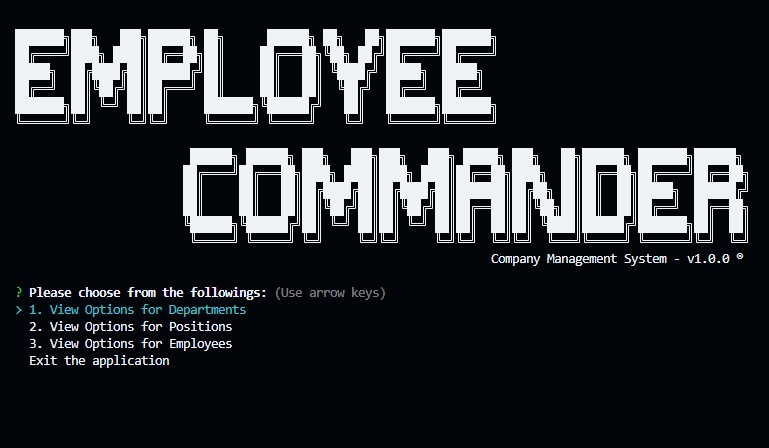

  

---

# Employee Commander v1.0.0

## Description



This is a command-line application that is used to manage a company's employee database. It allows the user to view, add, update, and delete employees, roles, and departments. It can also view the total utilized budget of departments (the combined salaries of all employees in that department). It is a Node.js application that uses MySQL database and Inquirer module.

## *See installation instructions below to install the necessary dependencies before running the application!*


---

## Table of Contents

- [Installation](#installation)
- [Usage](#usage)
- [Credits](#credits)
- [License](#license)
- [Contributing](#contributing)
- [Tests](#tests)
- [Questions](#questions)

---

## Installation

Since this application uses Command-Line-Interface, you will have to run this program in your terminal.

To install necessary dependencies (inquirer module, etc), run the following command:

```bash
npm i
```

After module installation, you will need to create a database in MySQL: (make sure you have MySQL installed on your computer! If not, you can download it from <https://www.mysql.com/downloads/>, also make sure you have your .env file set up with your MySQL database name, username, and password!)

Your .env file should look like this:

```bash
  DATABASE=employees_db
  DATABASE_USERNAME=your_username
  DATABASE_PASSWORD=your_password
```

There's a sample database ('employees_db') and seed data in the 'db' folder that you can use to test the application. However, if you want to add your own data, you can do it so by creating your own schema and seed data but make sure you have the same table names, column names and types as the sample schema!

To start the application using the sample database and seed data, run the following commands in your terminal:

```bash
mysql -u root -p
source db/schema.sql
source db/seed.sql
```

---

## Usage

Once you have installed the necessary dependencies, created database, and added data, you can start the application by running the following command in your terminal:

```bash
npm start
```

OR

```bash
node server.js
```

And you will be prompted with a list of options: View Options for Departments, View Options for Positions, View Options for Employees. You can select any of these options to view, add, update, or delete data. You can also select '<= GO BACK' option to go back to the previous menu.

To exit, you can press 'CTRL + C' in any stage (any unsaved data will be lost!), or you can select 'Exit the application' option to exit the application.

Here's a walkthrough video that demonstrates the functionality and codes of the application:

<"COMING SOON!">

---

## License

This project is licensed under the ISC license. Please see LICENSE.md for more information.

---

## Credits

Special thanks to Irina Kudosova (a tutor) for great advice on how to structure the code!

Thank you to the following resources that helped me complete this project:

* ASCII Text Converter: <https://patorjk.com>
* Console-Table-Printer: <https://console-table.netlify.app>
* MySQL: <https://www.w3schools.com/mysql/mysql_sql.asp>
* Inquirer: <https://www.npmjs.com/package/inquirer#methods>

---

## Contributing

For contributions, please create a new branch of the project and submit a pull request. Any contributions are greatly appreciated. Issues can be submitted in the issues section of the repo or by emailing me directly (see Questions section below).

---

## Tests

Test feature is NOT available at this time. When it becomes available you should be able to run tests using the following command:

```bash
npm run test
```

---

## Questions

If you have any questions about the repo, open an issue or contact me directly at:

Github: [jyoungjoon](https://github.com/jyoungjoon)

Email: lifescriptified@gmail.com

---
